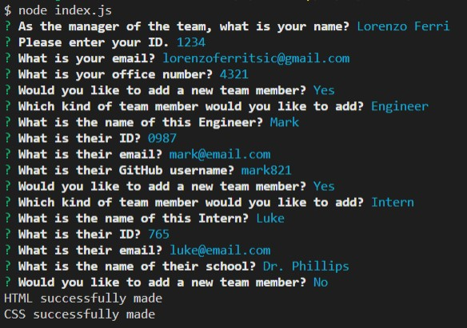

# Challenge 10- TeamGen

## What it does

This application builds a team with information such as the manager, engineer, or interns as well as company IDs, employee emails, github account usernames, and school names for the interns.

## Installation

npm i in the root folder, then run index.js using node index.js

## Github Links

Deployed: https://lorenzoftsic.github.io/TeamGen/ \
Repo: https://github.com/LorenzoFTSIC/TeamGen

 